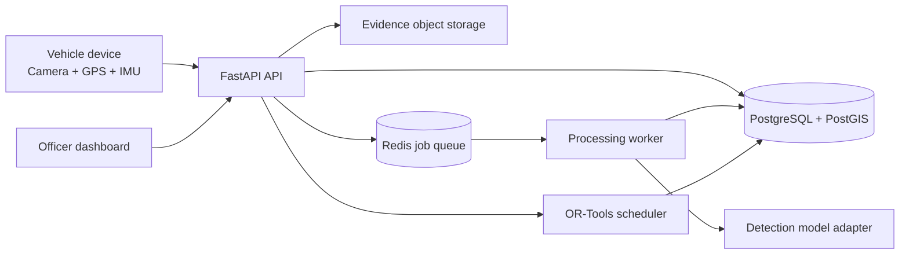

# System Architecture

## Goals

1. Convert intermittent vehicle observations into persistent, location-aware road defects.
2. Combine visual evidence with phone motion data without hiding the scoring logic.
3. Give municipal officers a review checkpoint before maintenance action.
4. Rank work using defect severity, road context, recurrence, and evidence quality.
5. Preserve an audit trail from first observation through post-repair validation.

## Context and boundaries



### Service ownership

| Area | Owns | Does not own |
| --- | --- | --- |
| `apps/web` | Map, issue queue, verification, schedule, repair views | Detection or scoring rules |
| `services/api` | Authentication boundary, request validation, domain commands, read models | Long-running model inference |
| `services/worker` | Clip screening, temporal tracking, sensor fusion, clustering, scoring, repair checks | Browser UI or direct officer actions |
| `packages/contracts` | Versioned event names, request/response shapes, status enums | Database migrations or business decisions |
| `infra` | Local dependencies, deployment configuration, operational defaults | Product logic |

## Processing lifecycle

1. **Ingest:** accept a short evidence clip and synchronized GPS/IMU metadata. Store large media in object storage and metadata in PostgreSQL.
2. **Screen:** run the model adapter on-device when available; the server worker supports the demo fallback. Upload only triggered clips in the MVP.
3. **Track:** collapse consecutive frames from one trip into one observation event.
4. **Fuse:** combine vision confidence, impact evidence, and repeat observations into an evidence score.
5. **Consolidate:** merge nearby events of the same defect type into a persistent defect using PostGIS distance and a time window.
6. **Assess:** estimate severity and aggregate a road-segment health score.
7. **Prioritize:** calculate an explainable priority score using severity, road criticality, recurrence, evidence count, and recency.
8. **Verify:** an officer confirms, rejects, or modifies severity. Only confirmed defects become schedulable.
9. **Schedule:** assign verified work to crews subject to availability, skills, travel, and repair windows.
10. **Validate:** compare post-repair evidence against the defect and record resolved, unresolved, or uncertain status.

## Core entities

- `observation`: one device report with location, timestamp, sensor metadata, media reference, and model output.
- `defect`: the persistent issue created by consolidating observations.
- `road_segment`: a mapped road unit with context such as road class, traffic, and nearby critical POIs.
- `verification`: an officer decision and optional corrected severity with actor and timestamp.
- `crew`: available municipal maintenance resources, skills, and working windows.
- `repair`: scheduled and actual work, materials, status, and post-repair evidence.
- `audit_event`: immutable lifecycle history for traceability.

## Explainable scoring contract

The first implementation should keep all weights configurable and return score components with every result.

```text
evidence_score = 0.50 * vision_confidence
               + 0.25 * impact_match
               + 0.25 * repeat_observation_factor

priority_score = 0.35 * severity
               + 0.25 * road_criticality
               + 0.20 * recurrence
               + 0.10 * evidence_score
               + 0.10 * recency
```

Each input is normalized to `[0, 1]`. Officer-modified severity replaces the model estimate and triggers a priority recalculation. The weights are a starting configuration, not a validated municipal standard; validation data must be collected before operational use.

## API slices

```text
POST   /v1/observations
GET    /v1/defects
GET    /v1/defects/{defect_id}
POST   /v1/defects/{defect_id}/verification
POST   /v1/repairs/plan
PATCH  /v1/repairs/{repair_id}
POST   /v1/repairs/{repair_id}/validation
GET    /v1/road-segments/health
GET    /health
```

The API should expose score components, confidence, source observations, and lifecycle status so the dashboard never needs to reproduce domain rules.

## Non-functional decisions

- **Privacy:** retain triggered evidence only, blur faces and license plates before display, and define a retention period for raw clips.
- **Reliability:** ingestion is idempotent by device event ID; processing jobs are retryable.
- **Auditability:** officer decisions and score changes are append-only audit events.
- **Domain shift:** every observation records vehicle type, camera metadata, lighting, and weather when available.
- **Demo honesty:** synthetic crew, repair, and municipal context records are marked with a `synthetic` provenance field.

## Implementation order

1. Contracts, database schema, health endpoint, and observation ingestion.
2. Seed data and defect list/map read model.
3. Worker adapters for detection, fusion, clustering, and scoring.
4. Officer verification workflow and audit events.
5. Repair scheduling and post-repair validation.
6. Car/bike sensor recordings, weather tags, metrics, and model evaluation.